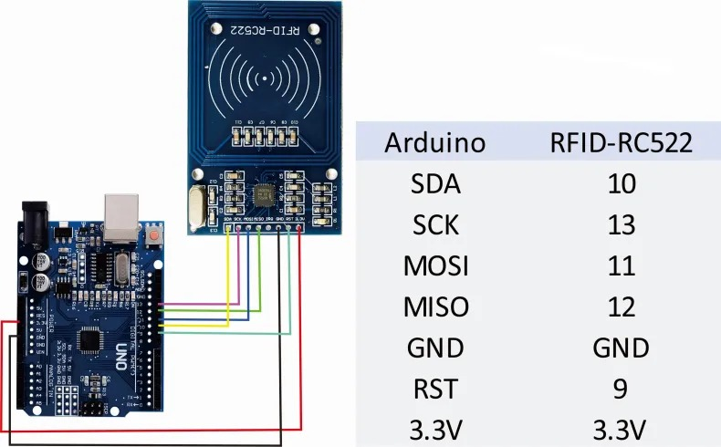
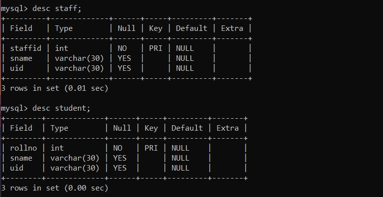
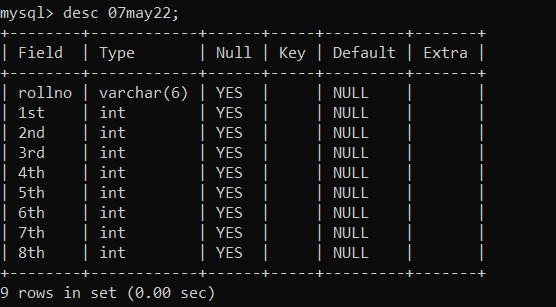

# PSG Hackathon - Team Invictus

## Members

- Suryah D K (20I210)
- Tharunprasath A S (20I250)
- Yuvarraj S (20I254)
 

## Problem Statement: PS3 - IOT & Hardware: Automatic attendance system

### Overview

> In a classroom, time is wasted in roll calls as it is done manually. In this proposed system, authorised student is given an RFID tag. RFID [Radio Frequency Identification] based participation framework is an application that will electronically screen the participation of the understudies or the representatives. RFID is an arising innovation which has the capacity of distinguishing exceptional people. This won't permit any strangers to go into the association or the organisation without the character card that will be utilised to screen the participation. The principal parts of the RFID framework are the RFID labels and the RFID per user. The principle point of this venture is to keep up with the subtleties of the workers of the association or the understudies of the foundation by utilising the RFID labels or tag.

 

### Implementation

> We implement this idea using RFID module, once a professor or staff enters into the class he will scan his RFID card and then the attendance portal for the students will be open by the professor and then the students can scan their respective RFID cards and they can give their attendance for the corresponding period. In parallel the session will get recorded to identify who is scanning in the future. The proxying of the students/staff can also be reduced with help of recorded video.

 

### Tools and Technologies used

> - ARDUNIO UNO
> - RFID MODULE MFRC522 READER
> - RFID TAGS
> - DATABASE SERVER (MYSQL)
> - HOSTING SERVER
> - CAMERA MODULE

 

### How to run
> - Upload the arduino code to the arudino uno with the given pin out diagram.
> - Install the required libraries by using 

    pip install -r requirments.txt
> Clone this repository and run the file `arduino.py`, after connecting all the requirements .

 

### Pin out diagram

<kbd></kbd>

 

### Libraries and drivers used

> - Serial - For reteriving value from serial output of arduino.
> - Mysql connector - For connecting to the database.
> - datetime - For fetching the current data and time.

 

### Tables Created
<kbd></kbd>

 

### Attendance table
This will created daily and attendance will be updated
<kbd></kbd>

 

### Backend

> - At first, our backend checks whether the table is created for today, if not new table will be created for each student, with eight column which corresponds to eight period.
> - Initially all the student will be absent, as they scan the RFID card on the RFID reader, the attendance will be given to the corresponding student.
> - Attendance will be given according to the time they scan the RFID card, for example if student scans the RFID card at 8:35 AM, the attendance will be given to the student for the first period.

 

### Withholden

> - We need to add further ideas for improving the proxying of students.
> - As students enter the attendance for 1st period, they need to manually once again enter the attendance for the upcoming hours. We will provide solution to overcome this problem.
> - We missed out the hardware implementation due to an defect in RF Module.
> - We wil also add face recognition for the current exisiting module.

 

`Thank you !`
